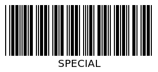
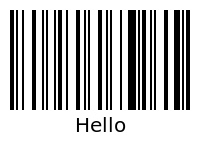
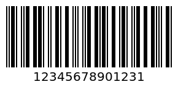
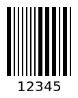

# Barcode Types Generate BarCode API - CODE, CODE39, Pharamacode  | APITier

* Generate generate-barcode-api as a PNG file with the provided text parameter. supported type like CODE39, CODE128, ITF-14, Pharamacode.

## CODE39
* CODE39, the first generate-barcode-api alpha-numeric symbology to use alphabetic characters and numeric digits. CODE39 generate-barcode-api used in industries, Logistics Applications and non-retail environments.

### Sample Request

```bash title="Example Curl Request" 
curl --location --request POST 'https://barcode.apitier.com/v1/generate/code39?x-api-key=hv90CBlVBN9R6Tbfx4wsg3CxRTXyk9CA6bvx2f11' \
--header 'Content-Type: application/json' \
--data-raw '{
    "text": "Special",
    "options": {
        "textAlign": "left",
        "textPosition": "top",
        "font": "cursive",
        "fontOptions": "bold",
        "fontSize": 40,
        "textMargin": 15
    }
}'
```

### Sample Response



### Example

| Parameter          | Type    |    Description                            |
| -------------------|-------- | ---------------------------------------   |
| Request URL        | String  |https://barcode.apitier.com/v1/generate/code39 |
| Request Method     | String  |**POST Request Method -** Parameters need to be send as JSON object in the request body.                                     |
| Request Body       | String  |generate-barcode-api is customizable with the following options: <br />**text<br /> textAlign<br /> textPosition <br />font <br />fontOptions<br /> fontSize<br /> textMargin**| 
| Response           | String  |              |


## CODE128
* CODE128 is a high-density linear generate-barcode-api symbology.It is used for alphabetic characters and numeric digits. It contains numbers, letters and symbol characters. CODE128 is used in hipping labels, enterprise internal management,  management information systems, production processes, and logistics control systems.

### Sample Request

```bash title="Example Curl Request"      
curl --location --request POST 'https://barcode.apitier.com/v1/generate/code128?x-api-key=hv90CBlVBN9R6Tbfx4wsg3CxRTXyk9CA6bvx2f11' \
--header 'Content-Type: application/json' \
--data-raw '{
    "text": "Hello",
    "options": {
        "fontSize": 40,
        "background": "#4b8b7f",
        "lineColor": "#ffffff",
        "margin": 40,
        "marginLeft": 80
    }
}'
```

### Sample Response



### Example

| Parameter          | Type    |    Description                            |
| -------------------|-------- | ---------------------------------------   |
| Request URL        | String  |https://barcode.apitier.com/v1/generate/code128 |
| Request Method     | String  |**POST Request Method -** Parameters need to be send as JSON object in the request body.                                         |
| Request Body       | String  |generate-barcode-api is customizable with the following options: <br />**text<br /> fontSize<br /> background <br />font <br />lineColor<br /> margin<br /> marginLeft**| 
| Response           | String  |              |


## ITF-14
* The itf14 will always encode 14 digits. ITF-14 generate-barcode-api is used in packaging levels of a product, retailers, manufacturers, and distributors for accurate logistical and inventory handling.

### Sample Request

```bash title="Example Curl Request" 
curl --location --request POST 'https://barcode.apitier.com/v1/generate/itf14?x-api-key=hv90CBlVBN9R6Tbfx4wsg3CxRTXyk9CA6bvx2f11' \
--header 'Content-Type: application/json' \
--data-raw '{
    "text": "1234567890123",
    "options": {
        "displayValue": true,
        "width": 2,
        "height": 100,
        "font": "monospace",
        "fontSize": "20",
        "fontOptions": "bold",
        "textAlign": "center",
        "textPosition": "top",
        "textMargin": "2",
        "background": "#ffffff",
        "lineColor": "#000000"
    }
}'
```

### Sample Response



### Example

| Parameter          | Type    |    Description                            |
| -------------------|-------- | ---------------------------------------   |
| Request URL        | String  |https://barcode.apitier.com/v1/generate/itf14 |
| Request Method     | String  |**POST Request Method -** Parameters need to be send as JSON object in the request body.                                         |
| Request Body       | String  |generate-barcode-api is customizable with the following options: <br />**text<br /> displayValue<br /> width <br />height <br />font<br /> fontSize<br /> fontOptions<br /> fontSize<br /> textAlign<br /> background<br /> lineColor<br /> textPosition<br /> textMargin**| 
| Response           | String  |              |


## Pharamacode
* Pharmacode is used in the packaging of pharmaceuticals. Pharamacode represents only a encode number between 3 and 131070

### Sample Request

```bash title="Example Curl Request" 
curl --location --request POST 'https://barcode.apitier.com/v1/generate/pharmacode?x-api-key=hv90CBlVBN9R6Tbfx4wsg3CxRTXyk9CA6bvx2f11' \
--header 'Content-Type: application/json' \
--data-raw '{
    "text": "12345",
    "options": {
        "lineColor": "#0aa",
        "width": 4,
        "height": 40,
        "displayValue": false
    }
}'
```

### Sample Response



### Example

| Parameter          | Type    |    Description                            |
| -------------------|-------- | ---------------------------------------   |
| Request URL        | String  |https://barcode.apitier.com/v1/generate/pharmacode |
| Request Method     | String  |**POST Request Method -** Parameters need to be send as JSON object in the request body.                                         |
| Request Body       | String  |generate-barcode-api is customizable with the following options: <br />**text<br /> lineColor<br /> width <br />height <br />displayValue**| 
| Response           | String  |              |


