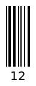
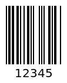
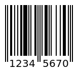
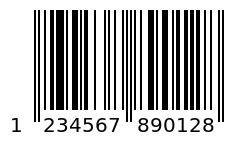

# Barcode Types - EANCODE, EAN-2, EAN-5 EAN-8, EAN-13, UPC  | APITier

* Generate generate-barcode-api as a PNG file with the provided text parameter. supported type like EAN-2, EAN-5, EAN-8, EAN13, UPC.
EAN is stand for European Article Number. EAN is a numbering system. It is used in global trade to identify a specific retail product type, in a specific packaging configuration, from a specific manufacturer.


## EAN-2
* The EAN-2 generate-barcode-api will always encode 2 digits. Code text capacity only 2 digits. It is  used on magazines and periodicals to indicate an issue number.

### Sample Request

```bash title="Example Curl Request" 
curl --location --request POST 'https://barcode.apitier.com/v1/generate/ean2?x-api-key=hv90CBlVBN9R6Tbfx4wsg3CxRTXyk9CA6bvx2f11' \
--header 'Content-Type: application/json' \
--data-raw '{
    "text": "12",
    "width": 50,
    "height": 100
    
    
}'
```

### Sample Response



### Example

| Parameter          | Type    |    Description                            |
| -------------------|-------- | ---------------------------------------   |
| Request URL        | String  |https://barcode.apitier.com/v1/generate/ean2 |
| Request Method     | String  |**POST Request Method -** Parameters need to be send as JSON object in the request body.                                     |
| Request Body       | String  |generate-barcode-api is customizable with the following options: <br />**text<br /> width<br /> height <br />**| 
| Response           | String  |              |


## EAN-5
* The EAN-5 generate-barcode-api will always encode 5 digits. Code text capacity only 5 digits.  It is used to give a suggestion for the price of the book.

### Sample Request

```bash title="Example Curl Request" 
curl --location --request POST 'https://barcode.apitier.com/v1/generate/ean5?x-api-key=hv90CBlVBN9R6Tbfx4wsg3CxRTXyk9CA6bvx2f11' \
--header 'Content-Type: application/json' \
--data-raw '{
    "text": "12345",
    "displayValue": true,
        "width": 10,
        "height": 100,
        "font": "monospace",
        "fontSize": "20",
        "fontOptions": "bold",
        "textAlign": "center",
        "textPosition": "top",
        "textMargin": "2",
        "background": "#ffffff",
        "lineColor": "#000000"
}'
```

### Sample Response



### Example

| Parameter          | Type    |    Description                            |
| -------------------|-------- | ---------------------------------------   |
| Request URL        | String  |https://barcode.apitier.com/v1/generate/ean5 |
| Request Method     | String  |**POST Request Method -** Parameters need to be send as JSON object in the request body.                                         |
| Request Body       | String  |generate-barcode-api is customizable with the following options: <br />**text<br />displayValue<br /> width<br /> height <br /> font <br />fontSize<br /> fontOptions <br />textAlign <br />font <br />textPosition<br /> textMargin<br /> background<br />lineColor**| 
| Response           | String  |              |


## EAN-8
* The EAN-8 generate-barcode-api will always encode 8 digits. Code text capacity only 8 digits. It is used to encode  8-digit Global Trade Identification Numbers(GTIN-8) which are product identifiers from the GS1 System.

### Sample Request

```bash title="Example Curl Request" 
curl --location --request POST 'https://barcode.apitier.com/v1/generate/ean8?x-api-key=hv90CBlVBN9R6Tbfx4wsg3CxRTXyk9CA6bvx2f11' \
--header 'Content-Type: application/json' \
--data-raw '{
        "text": "12345670",
        "width": 10,
        "height": 100,
        "textPosition": "top",
        "textAlign": "center",
        "font": "monospace",
        "fontSize": "20",
        "fontOptions": "bold"
        
}'
```

### Sample Response



### Example

| Parameter          | Type    |    Description                            |
| -------------------|-------- | ---------------------------------------   |
| Request URL        | String  |https://barcode.apitier.com/v1/generate/ean8 |
| Request Method     | String  |**POST Request Method -** Parameters need to be send as JSON object in the request body.                                         |
| Request Body       | String  |generate-barcode-api is customizable with the following options: <br />**text<br /> width <br />height <br />textPosition<br />textAlign<br /> font<br /> fontSize<br /> fontOptions<br />**| 
| Response           | String  |              |


## EAN-13
* The EAN-13 generate-barcode-api will always encode 13 digits. Code text capacity is 12 digits + 1 check digit.

### Sample Request

```bash title="Example Curl Request" 
curl --location --request POST 'https://barcode.apitier.com/v1/generate/EAN13?x-api-key=hv90CBlVBN9R6Tbfx4wsg3CxRTXyk9CA6bvx2f11' \
--header 'Content-Type: application/json' \
--data-raw '{
        "text": "1234567890128",
        "format":"EAN13",
        "displayValue": "true",
        "width": 70,
        "height": 90,
        "font": "fantasy",
        "fontSize": "20",
        "fontOptions": "bold italic",
        "textAlign": "center",
        "textPosition": "top",
        "textMargin": "2",
        "background": "#ffffff",
        "lineColor": "#000000"

}'
```

### Sample Response



### Example

| Parameter          | Type    |    Description                            |
| -------------------|-------- | ---------------------------------------   |
| Request URL        | String  |https://barcode.apitier.com/v1/generate/EAN13 |
| Request Method     | String  |**POST Request Method -** Parameters need to be send as JSON object in the request body.                                         |
| Request Body       | String  |generate-barcode-api is customizable with the following options: <br />**text<br />format<br /> displayValue<br /> width<br /> height <br /> font <br />fontSize<br /> fontOptions <br />textAlign <br />textPosition<br /> textMargin<br /> background<br />lineColor**| 
| Response           | String  |              |


## UPC
* The UPC stands for Universal Product Code. UPC is a generate-barcode-api symbology that is widely used in the United States, Canada, Europe, Australia, New Zealand, and other countries for tracking trade items in stores. It is used for product identification in the US retail industry.<br />
The UPC generate-barcode-api will always encode 12 digits. Code text capacity is 11 digits + 1 check digit.

### Sample Request

```bash title="Example Curl Request" 
curl --location --request POST 'https://barcode.apitier.com/v1/generate/upc?x-api-key=hv90CBlVBN9R6Tbfx4wsg3CxRTXyk9CA6bvx2f11' \
--header 'Content-Type: application/json' \
--data-raw '{
        "text": "123456789012",
        "format":"upc",
        "displayValue": "true",
        "width": 85,
        "height": 60,
        "font": "fantasy",
        "fontSize": "40",
        "fontOptions": "italic",
        "textAlign": "center",
        "textPosition": "top",
        "textMargin": "25",
        "background": "#ccffff",
        "lineColor": "#000000"
}'
```

### Sample Response


### Example

| Parameter          | Type    |    Description                            |
| -------------------|-------- | ---------------------------------------   |
| Request URL        | String  |https://barcode.apitier.com/v1/generate/upc |
| Request Method     | String  |**POST Request Method -** Parameters need to be send as JSON object in the request body.                                         |
| Request Body       | String  |generate-barcode-api is customizable with the following options: <br />**text<br />format<br /> displayValue<br /> width<br /> height <br /> font <br />fontSize<br /> fontOptions <br />textAlign <br />textPosition<br /> textMargin<br /> background<br />lineColor**| 
| Response           | String  |              |


