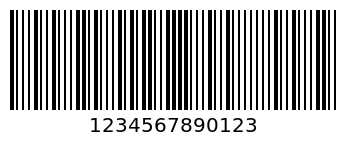
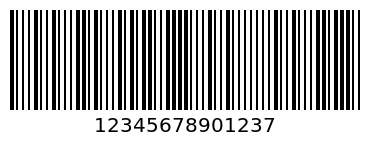
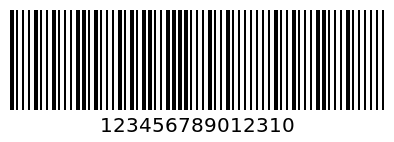
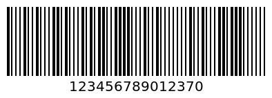

# Barcode Types - MSI, MSI10, MSI11, MSI1010  | APITier

* Generate generate-barcode-api as a PNG file with the provided text parameter. supported type like MSI, MSI10, MSI11, MSI1010,MSI1110.
* The MSI generate-barcode-api is used to identify small and medium-sized enterprises. The MSI generate-barcode-api can be used to identify the company and the product that the enterprise is manufacturing. It supports digits 0-9.

## MSI
* MSI generate-barcode-api is also known as Modified Plessey . It is used for inventory control, marking storage containers and shelves in warehouse environments. It supports digits 0-9.

### Sample Request

```bash title="Example Curl Request" 
curl --location --request POST 'https://barcode.apitier.com/v1/generate/msi?x-api-key=hv90CBlVBN9R6Tbfx4wsg3CxRTXyk9CA6bvx2f11' \
--header 'Content-Type: application/json' \
--data-raw '{
    "text": "1234567890123"
    
}'
```

### Sample Response



### Example

| Parameter          | Type    |    Description                            |
| -------------------|-------- | ---------------------------------------   |
| Request URL        | String  |https://barcode.apitier.com/v1/generate/msi |
| Request Method     | String  |**POST Request Method -** Parameters need to be send as JSON object in the request body.                                     |
| Request Body       | String  |generate-barcode-api is customizable with the following options: <br />**text<br />**| 
| Response           | String  |              |


## MSI10

### Sample Request

```bash title="Example Curl Request" 
curl --location --request POST 'https://barcode.apitier.com/v1/generate/msi10?x-api-key=hv90CBlVBN9R6Tbfx4wsg3CxRTXyk9CA6bvx2f11' \
--header 'Content-Type: application/json' \
--data-raw '{
    "text": "1234567890123"
}'
```

### Sample Response



### Example

| Parameter          | Type    |    Description                            |
| -------------------|-------- | ---------------------------------------   |
| Request URL        | String  |https://barcode.apitier.com/v1/generate/msi10 |
| Request Method     | String  |**POST Request Method -** Parameters need to be send as JSON object in the request body.                                         |
| Request Body       | String  |generate-barcode-api is customizable with the following options: <br />**text<br />**| 
| Response           | String  |              |


## MSI11


### Sample Request

```bash title="Example Curl Request" 
curl --location --request POST 'https://barcode.apitier.com/v1/generate/msi11?x-api-key=hv90CBlVBN9R6Tbfx4wsg3CxRTXyk9CA6bvx2f11' \
--header 'Content-Type: application/json' \
--data-raw '{
    "text": "1234567890123"
}'
```

### Sample Response



### Example

| Parameter          | Type    |    Description                            |
| -------------------|-------- | ---------------------------------------   |
| Request URL        | String  |https://barcode.apitier.com/v1/generate/msi11 |
| Request Method     | String  |**POST Request Method -** Parameters need to be send as JSON object in the request body.                                         |
| Request Body       | String  |generate-barcode-api is customizable with the following options: <br />**text<br />**| 
| Response           | String  |              |


## MSI1010


### Sample Request

```bash title="Example Curl Request" 
curl --location --request POST 'https://barcode.apitier.com/v1/generate/msi1010?x-api-key=hv90CBlVBN9R6Tbfx4wsg3CxRTXyk9CA6bvx2f11' \
--header 'Content-Type: application/json' \
--data-raw '{
    "text": "1234567890123"
}'
```

### Sample Response



### Example

| Parameter          | Type    |    Description                            |
| -------------------|-------- | ---------------------------------------   |
| Request URL        | String  |https://barcode.apitier.com/v1/generate/msi1010 |
| Request Method     | String  |**POST Request Method -** Parameters need to be send as JSON object in the request body.                                         |
| Request Body       | String  |generate-barcode-api is customizable with the following options: <br />**text<br />**| 
| Response           | String  |              |


## MSI1110


### Sample Request

```bash title="Example Curl Request" 
curl --location --request POST 'https://barcode.apitier.com/v1/generate/msi1110?x-api-key=hv90CBlVBN9R6Tbfx4wsg3CxRTXyk9CA6bvx2f11' \
--header 'Content-Type: application/json' \
--data-raw '{
    "text": "1234567890123"
}'
```

### Sample Response


### Example

| Parameter          | Type    |    Description                            |
| -------------------|-------- | ---------------------------------------   |
| Request URL        | String  |https://barcode.apitier.com/v1/generate/msi1110 |
| Request Method     | String  |**POST Request Method -** Parameters need to be send as JSON object in the request body.                                         |
| Request Body       | String  |generate-barcode-api is customizable with the following options: <br />**text<br />**| 
| Response           | String  |              |


